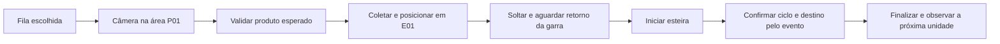

# Operação por câmera, fila e eventos

O operador escolhe produtos cadastrados e quantidades no Dashboard. **Iniciar
fluxo** inicia a observação da área de coleta; não pede um identificador digitado.
A aplicação autoriza um ciclo quando a etiqueta corresponde à cabeça da fila.
Uma etiqueta fora da ordem, desconhecida, inativa ou excluída não autoriza coleta.



Há uma unidade em transporte por vez. A fila é uma ordem de trabalho, não um
mapa de posições de vários objetos: apresente a unidade esperada no ponto fixo
P01. A garra não procura um produto escondido em outro ponto da bancada.

## Banco mínimo no projeto

`data/catalogo-inicial.json` contém os produtos, UFs, IDs ArUco e reservas dos
identificadores excluídos. Uma instalação nova importa esse arquivo **somente
se o banco estiver vazio**. Um banco existente, inclusive com todos os produtos
excluídos, não é substituído nem repovoado.

`data/inteliesteira.db` é o SQLite local: conserva produtos, fila, tentativas,
ciclos e eventos. Não depende de instalar um servidor de banco. O JSON é a base
versionada; o SQLite guarda os dados que mudam durante a operação. Novos cadastros
continuam exigindo exportar um catálogo atualizado para levá-los a outra máquina.

Recarregar a página preserva a fila. Reiniciar o servidor não reinicia movimentos:
um item que estava em processamento fica **INTERROMPIDO**. Se o ciclo já havia
sido registrado como finalizado, a fila reconcilia esse registro sem repetir a
coleta. Duas instâncias não podem adquirir a mesma fila ativa.

## Testar agora, sem Arduino

Primeiro terminal, na raiz do projeto:

```powershell
.\.venv\Scripts\python.exe -m hardware.serial_simulator
```

Segundo terminal:

```powershell
$env:HARDWARE_MODE = "simulator"
$env:ARDUINO_SIMULATOR_PORT = "8766"
$env:CONVEYOR_MODE = "arduino"
$env:ARRIVAL_SENSOR_MODE = "conveyor"
$env:CAMERA_MODE = "opencv"
$env:CAMERA_INDEX = "0"
.\.venv\Scripts\python.exe start.py
```

No Dashboard: escolha produtos, adicione-os na sequência e clique em **Testar
comunicação**. Isso troca PING/ACK, sem movimentar equipamentos. Clique em
**Iniciar fluxo** e apresente a etiqueta esperada à webcam. Com a câmera real,
a API não aceita injetar um identificador no lugar da imagem.

Para testar sem webcam, use `CAMERA_MODE=mock`. O Dashboard mostra um seletor
**Simular leitura**, separado do planejamento da fila. Apresentar o segundo
produto antes do primeiro demonstra que a ordem bloqueia a coleta.

O simulador troca bytes via TCP localhost usando o adaptador pySerial, em vez de
apenas chamar funções de um mock. Isso testa enquadramento das mensagens,
correlação, ACK, conclusão, timeout e desconexão. Não testa USB, baud rate,
eletrônica ou motores. [Referência do transporte socket do pySerial](https://pyserial.readthedocs.io/en/latest/url_handlers.html#socket).

Abra **Mensagens e confirmações dos dispositivos** para acompanhar TX/RX,
CMD/ACK/EVT, ciclo e mensagem. O histórico associa o mesmo ciclo ao produto, UF,
macrorregião e destino. O modo de teste e a chegada simulada são exibidos.

## Contrato da comunicação

O backend resolve produto/UF/região. O hardware recebe ciclo, destino e perfis de
movimento; o identificador do ciclo vincula essas mensagens ao cadastro e histórico.

| Etapa | Comando | Confirmação necessária |
| --- | --- | --- |
| Disponibilidade do dispositivo | `CMD:c1:SISTEMA:PING` | `ACK:c1:SISTEMA:PING` |
| Definir região/saída | `CMD:c1:DESTINO:R07` | ACK do comando |
| Selecionar coleta | `CMD:c1:GARRA:AREA:P01` | ACK do comando |
| Coletar | `CMD:c1:GARRA:PEGAR` | ACK e `EVT:c1:GARRA_COLETA_CONCLUIDA` |
| Mover até a esteira | `CMD:c1:GARRA:POSICIONAR:E01` | ACK e `EVT:c1:GARRA_POSICIONAMENTO_CONCLUIDO` |
| Soltar | `CMD:c1:GARRA:SOLTAR` | ACK e `EVT:c1:GARRA_ENTREGA_CONCLUIDA` |
| Retornar garra | `CMD:c1:GARRA:HOME` | ACK e `EVT:c1:GARRA_HOME_CONCLUIDO` |
| Transportar | `CMD:c1:ESTEIRA:START` | ACK, depois evento de chegada |
| Chegada física informada | sensor do destino | `EVT:c1:DESTINO_ALCANCADO:R07:SENSOR` |
| Falha | dispositivo | `ERR:c1:GARRA:PEGAR:MOTOR_BLOCKED`, por exemplo |

**ACK significa recebido/aceito. EVT significa conclusão informada.** ACK de
PEGAR não libera POSICIONAR; ACK de START não finaliza o ciclo. O próximo produto
só avança após conclusão. Retransmissão conserva ciclo/comando; o receptor deve
reenviar ACK sem reaplicar uma ação já iniciada. O simulador implementa essa regra.
Eventos de outro ciclo, saída incorreta ou confirmação que não seja EVT são recusados.

O fluxo envia heartbeats e para em perda de comunicação. Stop solicita parada
da esteira e da garra. Reset trata estado lógico; não escolhe coordenadas nem
reenfileira automaticamente uma operação parcial. Inspecione o objeto e use
**Tentar novamente** para uma tentativa nova, ou cancele o item.

## Como confirmar chegada na montagem física

O EV3 existente informa fim das rotações calibradas; isso não mede onde o objeto
parou. Para confirmar a região, o contrato prevê um sensor de passagem por saída
R01–R10, como uma barreira óptica, ligado a entradas identificadas no Arduino.
O sensor indica presença/passagem, não lê o ID do produto. A correlação funciona
porque há um único ciclo/unidade em transporte e a aplicação valida ciclo + saída.
[Exemplo de barreira óptica e leitura no Arduino](https://learn.adafruit.com/ir-breakbeam-sensors/arduino).

Quando o EV3 controla a esteira, use `ARRIVAL_SENSOR_MODE=arduino`: o backend envia
`SENSOR:ARMAR:R07` antes da coleta e `SENSOR:INICIAR:R07` após iniciar o transporte.
Armar deve limpar leituras antigas e verificar a condição inicial; só uma nova
borda do sensor esperado, com debounce, deve gerar o EVT SENSOR durante a janela
de transporte. Um sensor já bloqueado não deve produzir uma chegada instantânea.
`SENSOR:DESARMAR` encerra a observação daquele ciclo.

Os pinos, sensores, referências, limites mecânicos, driver dos motores e perfis
P01/E01 precisam ser definidos e testados na bancada. P01 e E01 são nomes de
perfis; não há coordenadas, ângulos ou homing inventados pelo aplicativo. A opção
`GRIPPER_PROFILE_CALIBRATED=1` só deve ser usada depois de implementar e verificar
esses perfis no firmware real. O perfil real fica bloqueado por padrão.

`REQUIRE_PHYSICAL_ARRIVAL=1` impede finalizar um transporte real com uma confirmação
simulada ou somente rotações do EV3. Para testes explicitamente estimados, a opção
pode ser desabilitada, mas a interface continuará mostrando ausência de comprovação
física. O firmware `arduino/mock.ino` é de bancada, não aciona pinos e emite chegada
SIMULADA. Ele não é o driver físico pronto da garra.

A webcam exige uma etiqueta por vez dentro da área P01. `CAMERA_PICKUP_ROI=x,y,w,h`
delimita o recorte com frações de 0 a 1; ajuste ao enquadramento real da bancada.
A aplicação espera três frames sem código visível entre unidades para impedir
releitura da etiqueta parada. Ausência de código não comprova ausência física do
objeto: a montagem real precisa de presença/limites e proteção mecânica adequados.
O balanceamento das duas saídas usa contagens de ciclos confirmados, não um sensor
de lotação. A parada de software também não substitui uma parada física de emergência.

## Exercitar falhas sem a placa

Pare o simulador e inicie uma das variantes. Para testes rápidos, configure
`GRIPPER_COMPLETION_TIMEOUT=2` e `ARRIVAL_TIMEOUT=3` no terminal do backend:

```powershell
# Perder ACK: o reenvio deve concluir sem duplicar a coleta.
.\.venv\Scripts\python.exe -m hardware.serial_simulator --drop-ack GARRA:PEGAR

# ACK recebido, mas sem conclusão: não pode posicionar, soltar ou iniciar a esteira.
.\.venv\Scripts\python.exe -m hardware.serial_simulator --suppress-event GARRA_COLETA_CONCLUIDA

# Saída incorreta: o ciclo deve falhar e a fila não pode avançar.
.\.venv\Scripts\python.exe -m hardware.serial_simulator --wrong-destination

# Interromper o transporte de mensagens durante a transferência.
.\.venv\Scripts\python.exe -m hardware.serial_simulator --disconnect-at GARRA:POSICIONAR:E01
```

Os testes automatizados cobrem leitura OpenCV/ArUco, câmera limitada à ROI,
fila planejada, etiqueta fora de ordem, barreira de repetição, confirmação da garra,
chegada, perda de ACK, desconexão, eventos de outro ciclo, posse exclusiva e
reinício sem repetição. Eles usam bancos temporários e hardware virtual:

```powershell
.\.venv\Scripts\python.exe -m unittest discover -s tests -v
```
